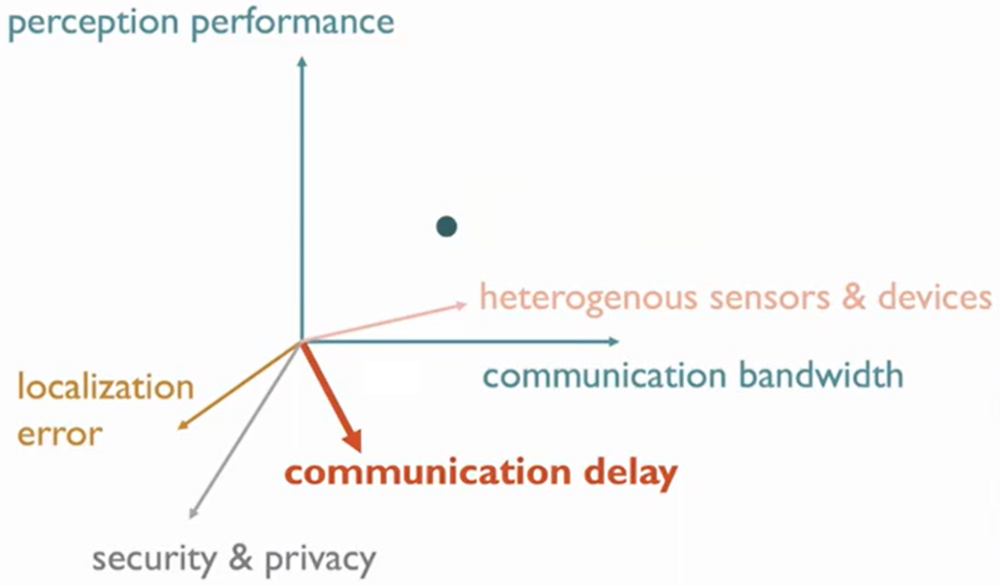

# Collaborative Perception

This repository is a paper digest of recent advances in **collaborative** / **cooperative** / **multi-agent** perception for **V2I** / **V2V** / **V2X** autonomous driving scenario. Papers are listed in alphabetical order of the first character.

## :star2:Recommendation

### Helpful Learning Resource:thumbsup::thumbsup::thumbsup:

- **(Talk)** Robust Collaborative Perception against Communication Interruption [[video](https://www.youtube.com/watch?v=3cIWpMrsyeE)], Collaborative and Adversarial 3D Perception for Autonomous Driving [[video](https://www.youtube.com/watch?v=W-AONQMfGi0)], Adversarial Robustness for Self-Driving [[video](https://www.youtube.com/watch?v=8uBFXzyII5Y)], Vehicle-to-Vehicle Communication for Self-Driving [[video](https://www.youtube.com/watch?v=oikdOpmIoc4)], 基于群体协作的超视距态势感知 [[video](https://www.koushare.com/video/videodetail/33015)], 协同自动驾驶：仿真与感知 [[video](https://course.zhidx.com/c/MmQ1YWUyMzM1M2I3YzVlZjE1NzM=)], 新一代协作感知Where2comm减少通信带宽十万倍 [[video](https://www.techbeat.net/talk-info?id=727)], 基于V2X的多源协同感知技术初探 [[video](https://www.bilibili.com/video/BV13v4y197Vc/)], 面向车路协同的群智机器网络 [[video](https://www.bilibili.com/video/BV1rV4y1w7kE/)]
- **(Survey)** Collaborative Perception in Autonomous Driving: Methods, Datasets and Challenges [[paper](https://arxiv.org/abs/2301.06262)], A Survey and Framework of Cooperative Perception: From Heterogeneous Singleton to Hierarchical Cooperation [[paper](https://arxiv.org/abs/2208.10590)]
- **(Library)** OpenCOOD: Open Cooperative Detection Framework for Autonomous Driving [[code](https://github.com/DerrickXuNu/OpenCOOD)] [[doc](https://opencood.readthedocs.io/en/latest/index.html)], CoPerception: SDK for Collaborative Perception [[code](https://github.com/coperception/coperception)] [[doc](https://coperception.readthedocs.io/en/latest/)]
- **(People)** Siheng Chen@SJTU [[web](https://scholar.google.com/citations?hl=en&user=W_Q33RMAAAAJ&view_op=list_works&sortby=pubdate)], Chen Feng@NYU [[web](https://scholar.google.com/citations?hl=en&user=YeG8ZM0AAAAJ&view_op=list_works&sortby=pubdate)], Jiaqi Ma@UCLA [[web](https://scholar.google.com/citations?hl=en&user=S3cQz1AAAAAJ&view_op=list_works&sortby=pubdate)], Jianping Wang@CityU [[web](https://scholar.google.com/citations?hl=en&user=bow_liAAAAAJ&view_op=list_works&sortby=pubdate)], Yen-Cheng Liu@GaTech [[web](https://ycliu93.github.io/)], Tsun-Hsuan Wang@MIT [[web](https://zswang666.github.io/)], Yiming Li@NYU [[web](https://roboticsyimingli.github.io/)], Runsheng Xu@UCLA [[web](https://derrickxunu.github.io/)], Hao Xiang@UCLA [[web](https://xhwind.github.io/)], Zixing Lei@SJTU [[web](https://chezacar.github.io/)], Yifan Lu@SJTU [[web](https://yifanlu0227.github.io/)], Hang Qiu@Waymo [[web](https://hangqiu.github.io/)], Zhengwei Bai@UCR [[web](https://zwbai.github.io/)], Eduardo Arnold@Niantic [[web](https://earnold.me/)]
- **(Workshop)** ICRA 2023 [[web](https://coperception.github.io/)], MFI 2022 [[web](https://coopermfi.github.io/)]
- **(Competition)** VIC3D Object Detection Challenge 清华AIR-百度Apollo车路协同自动驾驶算法挑战赛 [[info](https://aistudio.baidu.com/aistudio/competition/detail/522/0/introduction)]

### Typical Collaboration Modes:handshake::handshake::handshake:

### Possible Optimization Directions:fire::fire::fire:

### Published Benchmark Results:rocket::rocket::rocket:

- **V2XSet** (consider vehicles and infrastructures, pose error and time delay)

| Method | Source | Ideal AP@0.7 | Ideal AP@0.5 | Noisy AP@0.7 | Noisy AP@0.5 |
| :-: | :-: | :-: | :-: | :-: | :-: |
| [MPDA [ICRA'23]](https://arxiv.org/abs/2210.08451) | [link](https://arxiv.org/pdf/2210.08451) | :trophy:73.4:star2: | - | - | - |
| [V2X-ViT [ECCV'22]](https://arxiv.org/abs/2203.10638) | [link](https://arxiv.org/pdf/2203.10638) | :trophy:71.2:star: | :trophy:88.2:star2: | :trophy:61.4:star2: | :trophy:83.6:star2: |
| [DiscoNet [NeurIPS'21]](https://arxiv.org/abs/2111.00643) | [link](https://arxiv.org/pdf/2203.10638) | 69.5 | 84.4 | :trophy:54.1:star: | :trophy:79.8:star: |
| [F-Cooper [SEC'19]](https://arxiv.org/abs/1909.06459) | [link](https://arxiv.org/pdf/2203.10638) | 68.0 | 84.0 | 46.9 | 71.5 |
| [V2VNet [ECCV'20]](https://arxiv.org/abs/2008.07519) | [link](https://arxiv.org/pdf/2203.10638) | 67.7 | :trophy:84.5:star: | 49.3 | 79.1 |
| [AttFuse [ICRA'22]](https://arxiv.org/abs/2109.07644) | [link](https://arxiv.org/pdf/2203.10638) | 66.4 | 80.7 | 48.7 | 70.9 |
| === | === | === | === | === | === |
| Early Fusion (Upper Bound) | [link](https://arxiv.org/pdf/2203.10638) | **71.0** | **81.9** | 38.4 | **72.0** |
| Late Fusion | [link](https://arxiv.org/pdf/2203.10638) | 62.0 | 72.7 | 30.7 | 54.9 |
| No Fusion (Lower Bound) | [link](https://arxiv.org/pdf/2203.10638) | 40.2 | 60.6 | **40.2** | 60.6 |

- **OPV2V** (consider adaptation ability by a digital town with realistic configs)

| Method | Source | Default AP@0.7 | Default AP@0.5 | Culver AP@0.7 | Culver AP@0.5 |
| :-: | :-: | :-: | :-: | :-: | :-: |
| [AdaFusion [WACV'23]](https://arxiv.org/abs/2208.00116) | [link](https://arxiv.org/pdf/2208.00116) | :trophy:85.6:star2: | :trophy:91.6:star: | :trophy:79.0:star2: | :trophy:88.0:star: |
| [FuseBEVT [CoRL'22]](https://arxiv.org/abs/2207.02202) | [link](https://arxiv.org/pdf/2207.02202) | :trophy:85.2:star: | - | - | - |
| [V2VAM [Arxiv'22]](https://arxiv.org/abs/2212.08273) | [link](https://arxiv.org/pdf/2212.08273) | 84.9 | :trophy:92.0:star2: | 73.1 | :trophy:89.3:star2: |
| [CoBEVT [CoRL'22]](https://arxiv.org/abs/2207.02202) | [link](https://arxiv.org/pdf/2212.08273) | 83.6 | 91.4 | 74.8 | 87.7 |
| [DiscoNet [NeurIPS'21]](https://arxiv.org/abs/2111.00643) | [link](https://arxiv.org/pdf/2301.07325) | 83.6 | 89.9 | - | - |
| [V2X-ViT [ECCV'22]](https://arxiv.org/abs/2203.10638) | [link](https://arxiv.org/pdf/2208.00116) | 82.6 | 89.1 | 73.7 | 87.3 |
| [V2VNet [ECCV'20]](https://arxiv.org/abs/2008.07519) | [link](https://arxiv.org/pdf/2208.00116) | 82.2 | 89.7 | 73.4 | 86.0 |
| [FPV-RCNN [RAL'22]](https://arxiv.org/abs/2109.11615) | [link](https://github.com/DerrickXuNu/OpenCOOD) | 82.0 | - | :trophy:76.3:star: | - |
| [AttFuse [ICRA'22]](https://arxiv.org/abs/2109.07644) | [link](https://arxiv.org/pdf/2109.07644) | 81.5 | 90.8 | 73.5 | 85.4 |
| [MAMP [ICRA'23]](https://arxiv.org/abs/2203.13168) | [link](https://arxiv.org/pdf/2203.13168) | 81.3 | - | - | - |
| [F-Cooper [SEC'19]](https://arxiv.org/abs/1909.06459) | [link](https://arxiv.org/pdf/2208.00116) | 79.0 | 88.7 | 72.8 | 84.6 |
| [V2VAM+LCRN [Arxiv'22]](https://arxiv.org/abs/2212.08273) | [link](https://arxiv.org/pdf/2212.08273) | 78.3 | 88.7 | 70.9 | 87.1 |
| === | === | === | === | === | === |
| Early Fusion (Upper Bound) | [link](https://arxiv.org/pdf/2109.07644) | **80.0** | **89.1** | **69.6** | **82.9** |
| Late Fusion | [link](https://arxiv.org/pdf/2109.07644) | 78.1 | 85.8 | 66.8 | 79.9 |
| No Fusion (Lower Bound) | [link](https://arxiv.org/pdf/2109.07644) | 60.2 | 67.9 | 47.1 | 55.7 |

- **V2X-Sim 2.0** (multi-modality multi-agent data for detection, tracking and segmentation)

| Method | Source | Detection AP@0.7 | Detection AP@0.5 |
| :-: | :-: | :-: | :-: |
| [Where2comm [NeurIPS'22]](https://arxiv.org/abs/2209.12836) | [link](https://arxiv.org/pdf/2209.12836) | :trophy:74.1:star2: | :trophy:83.8:star2: |
| [FPV-RCNN [RAL'22]](https://arxiv.org/abs/2109.11615) | [link](https://arxiv.org/pdf/2211.07214) | :trophy:72.1:star: | 78.7 |
| [V2X-ViT [ECCV'22]](https://arxiv.org/abs/2203.10638) | [link](https://arxiv.org/pdf/2211.07214) | 68.1 | :trophy:79.2:star: |
| [Double-M Quantification [ICRA'23]](https://arxiv.org/abs/2209.08162) | [link](https://arxiv.org/pdf/2209.08162) | 66.4 | 70.4 |
| [DiscoNet [NeurIPS'21]](https://arxiv.org/abs/2111.00643) | [link](https://arxiv.org/pdf/2202.08449) | 63.4 | 69.0 |
| [AttFuse [ICRA'22]](https://arxiv.org/abs/2109.07644) | [link](https://arxiv.org/pdf/2211.07214) | 62.9 | 76.0 |
| [V2VNet [ECCV'20]](https://arxiv.org/abs/2008.07519) | [link](https://arxiv.org/pdf/2202.08449) | 62.8 | 68.4 |
| [CoAlign [ICRA'23]](https://arxiv.org/abs/2211.07214) | [link](https://arxiv.org/pdf/2211.07214) | 60.7 | 73.9 |
| [STAR [CoRL'22]](https://openreview.net/forum?id=hW0tcXOJas2) | [link](https://openreview.net/pdf?id=hW0tcXOJas2) | 57.2 | 62.8 |
| [Robust V2V [CoRL'20]](https://arxiv.org/abs/2011.05289) | [link](https://arxiv.org/pdf/2211.07214) | 56.0 | 69.3 |
| [F-Cooper [SEC'19]](https://arxiv.org/abs/1909.06459) | [link](https://arxiv.org/pdf/2211.07214) | 51.3 | 62.7 |
| [MASH [IROS'21]](https://arxiv.org/abs/2107.00771) | [link](https://arxiv.org/pdf/2211.07214) | 49.6 | 62.2 |
| [When2com [CVPR'20]](https://arxiv.org/abs/2006.00176) | [link](https://arxiv.org/pdf/2202.08449) | 39.9 | 44.0 |
| [Who2com [ICRA'20]](https://arxiv.org/abs/2003.09575) | [link](https://arxiv.org/pdf/2202.08449) | 39.9 | 44.0 |
| === | === | === | === |
| Early Fusion (Upper Bound) | [link](https://arxiv.org/pdf/2202.08449) | **67.0** | **70.4** |
| Late Fusion | [link](https://arxiv.org/pdf/2202.08449) | 39.1 | 44.0 |
| No Fusion (Lower Bound) | [link](https://arxiv.org/pdf/2202.08449) | 44.2 | 49.9 |

- The results above are directly borrowed from publicly accessible papers. Since some of the results here are reported by the following papers instead of the original ones, the most reliable data source links are also given. The best effort is tried to ensure that all the collected benchmark results are in the same training and testing settings (if provided).

### Reproduced Benchmark Results:sweat_drops::sweat_drops::sweat_drops:

- **OPV2V Default**

| Method | AP@0.7 | AP@0.5 | AP@0.3 |
| :-: | :-: | :-: | :-: |
| [V2VNet [ECCV'20]](https://arxiv.org/abs/2008.07519) | :trophy:84.6:star2: | :trophy:94.2:star2: | :trophy:94.7:star: |
| [AdaFusion [WACV'23]](https://arxiv.org/abs/2208.00116) | :trophy:83.6:star: | 93.6 | 94.1 |
| [FuseBEVT [CoRL'22]](https://arxiv.org/abs/2207.02202) | 83.3 | 93.0 | 93.7 |
| [Where2comm [NeurIPS'22]](https://arxiv.org/abs/2209.12836) | 82.3 | 93.5 | 94.0 |
| [DiscoNet [NeurIPS'21]](https://arxiv.org/abs/2111.00643) | 82.3 | 93.4 | 94.2 |
| [V2X-ViT [ECCV'22]](https://arxiv.org/abs/2203.10638) | 81.5 | :trophy:94.1:star: | :trophy:94.8:star2: |
| [F-Cooper [SEC'19]](https://arxiv.org/abs/1909.06459) | 81.4 | 93.4 | 94.2 |
| [AttFuse [ICRA'22]](https://arxiv.org/abs/2109.07644) | 81.2 | 93.1 | 93.8 |
| *[Where2comm [NeurIPS'22]](https://arxiv.org/abs/2209.12836)* | 80.7 | 92.2 | 92.9 |
| [When2com [CVPR'20]](https://arxiv.org/abs/2006.00176) | 75.6 | 89.5 | 90.1 |
| [Who2com [ICRA'20]](https://arxiv.org/abs/2003.09575) | 75.6 | 89.5 | 90.1 |
| *[When2com [CVPR'20]](https://arxiv.org/abs/2006.00176)* | 71.0 | 87.8 | 89.0 |
| *[Who2com [ICRA'20]](https://arxiv.org/abs/2003.09575)* | 66.9 | 86.0 | 87.3 |
| === | === | === | === |
| Early Fusion (Upper Bound) | **85.0** | **94.6** | **95.4** |
| Late Fusion | 76.2 | 90.9 | 91.8 |
| No Fusion (Lower Bound) | 65.1 | 87.9 | 89.8 |

- **OPV2V Culver**

| Method | AP@0.7 | AP@0.5 | AP@0.3 |
| :-: | :-: | :-: | :-: |
| [V2VNet [ECCV'20]](https://arxiv.org/abs/2008.07519) | :trophy:75.8:star2: | :trophy:88.0:star2: | :trophy:89.5:star2: |
| [DiscoNet [NeurIPS'21]](https://arxiv.org/abs/2111.00643) | :trophy:73.7:star: | :trophy:87.2:star: | :trophy:88.7:star: |
| [FuseBEVT [CoRL'22]](https://arxiv.org/abs/2207.02202) | 73.2 | 85.7 | 87.3 |
| [AttFuse [ICRA'22]](https://arxiv.org/abs/2109.07644) | 72.8 | 87.0 | 88.4 |
| [AdaFusion [WACV'23]](https://arxiv.org/abs/2208.00116) | 72.7 | 86.6 | 88.1 |
| [Where2comm [NeurIPS'22]](https://arxiv.org/abs/2209.12836) | 72.3 | 86.8 | 88.2 |
| *[Where2comm [NeurIPS'22]](https://arxiv.org/abs/2209.12836)* | 71.5 | 86.5 | 88.0 |
| [F-Cooper [SEC'19]](https://arxiv.org/abs/1909.06459) | 70.8 | 86.9 | :trophy:88.7:star: |
| [V2X-ViT [ECCV'22]](https://arxiv.org/abs/2203.10638) | 70.2 | 86.4 | 88.6 |
| [When2com [CVPR'20]](https://arxiv.org/abs/2006.00176) | 60.6 | 80.4 | 82.3 |
| [Who2com [ICRA'20]](https://arxiv.org/abs/2003.09575) | 60.6 | 80.4 | 82.3 |
| *[When2com [CVPR'20]](https://arxiv.org/abs/2006.00176)* | 58.7 | 79.1 | 81.5 |
| *[Who2com [ICRA'20]](https://arxiv.org/abs/2003.09575)* | 51.6 | 75.5 | 79.0 |
| === | === | === | === |
| Early Fusion (Upper Bound) | **73.5** | **88.2** | **89.8** |
| Late Fusion | 64.9 | 86.4 | 89.5 |
| No Fusion (Lower Bound) | 57.2 | 79.7 | 83.4 |

- **V2XSet Ideal**

| Method | AP@0.7 | AP@0.5 | AP@0.3 |
| :-: | :-: | :-: | :-: |
| [V2VNet [ECCV'20]](https://arxiv.org/abs/2008.07519) | :trophy:80.3:star2: | :trophy:92.0:star: | :trophy:93.0:star: |
| [DiscoNet [NeurIPS'21]](https://arxiv.org/abs/2111.00643) | :trophy:78.9:star: | :trophy:92.0:star: | 92.9 |
| [AdaFusion [WACV'23]](https://arxiv.org/abs/2208.00116) | 78.6 | :trophy:92.1:star2: | 92.9 |
| [FuseBEVT [CoRL'22]](https://arxiv.org/abs/2207.02202) | 78.5 | 90.8 | 91.8 |
| [Where2comm [NeurIPS'22]](https://arxiv.org/abs/2209.12836) | 78.0 | 91.6 | 92.4 |
| [AttFuse [ICRA'22]](https://arxiv.org/abs/2109.07644) | 77.1 | 91.0 | 91.9 |
| [V2X-ViT [ECCV'22]](https://arxiv.org/abs/2203.10638) | 76.3 | :trophy:92.1:star2: | :trophy:93.3:star2: |
| *[Where2comm [NeurIPS'22]](https://arxiv.org/abs/2209.12836)* | 76.0 | 90.1 | 91.0 |
| [F-Cooper [SEC'19]](https://arxiv.org/abs/1909.06459) | 75.8 | 91.4 | 92.6 |
| [When2com [CVPR'20]](https://arxiv.org/abs/2006.00176) | 67.9 | 86.4 | 87.5 |
| [Who2com [ICRA'20]](https://arxiv.org/abs/2003.09575) | 67.9 | 86.4 | 87.5 |
| *[When2com [CVPR'20]](https://arxiv.org/abs/2006.00176)* | 61.1 | 83.0 | 84.9 |
| *[Who2com [ICRA'20]](https://arxiv.org/abs/2003.09575)* | 60.4 | 81.8 | 83.8 |
| === | === | === | === |
| Early Fusion (Upper Bound) | **80.1** | **93.1** | **94.0** |
| Late Fusion | 67.4 | 87.2 | 89.3 |
| No Fusion (Lower Bound) | 57.9 | 83.5 | 86.6 |

- **V2XSet Noisy**

| Method | AP@0.7 | AP@0.5 | AP@0.3 |
| :-: | :-: | :-: | :-: |
| [V2VNet [ECCV'20]](https://arxiv.org/abs/2008.07519) | :trophy:57.0:star2: | :trophy:88.7:star2: | :trophy:92.7:star2: |
| [AttFuse [ICRA'22]](https://arxiv.org/abs/2109.07644) | :trophy:53.4:star: | 86.3 | 90.2 |
| [V2X-ViT [ECCV'22]](https://arxiv.org/abs/2203.10638) | 53.2 | 88.0 | :trophy:92.6:star: |
| [DiscoNet [NeurIPS'21]](https://arxiv.org/abs/2111.00643) | 52.7 | :trophy:88.2:star: | 92.1 |
| [Where2comm [NeurIPS'22]](https://arxiv.org/abs/2209.12836) | 52.7 | 87.4 | 91.0 |
| *[Where2comm [NeurIPS'22]](https://arxiv.org/abs/2209.12836)* | 51.3 | 85.9 | 89.7 |
| [AdaFusion [WACV'23]](https://arxiv.org/abs/2208.00116) | 51.2 | 87.8 | 92.1 |
| [FuseBEVT [CoRL'22]](https://arxiv.org/abs/2207.02202) | 51.1 | 85.9 | 89.8 |
| [F-Cooper [SEC'19]](https://arxiv.org/abs/1909.06459) | 50.4 | 86.5 | 90.8 |
| [When2com [CVPR'20]](https://arxiv.org/abs/2006.00176) | 48.2 | 81.4 | 85.2 |
| [Who2com [ICRA'20]](https://arxiv.org/abs/2003.09575) | 48.2 | 81.4 | 85.2 |
| *[When2com [CVPR'20]](https://arxiv.org/abs/2006.00176)* | 41.9 | 77.7 | 83.3 |
| *[Who2com [ICRA'20]](https://arxiv.org/abs/2003.09575)* | 37.2 | 75.8 | 82.2 |
| === | === | === | === |
| Early Fusion (Upper Bound) | 51.4 | **90.1** | **93.8** |
| Late Fusion | 40.3 | 77.2 | 86.4 |
| No Fusion (Lower Bound) | **57.9** | 83.5 | 86.6 |

- **Joint Set**

| Method | AP@0.7 | AP@0.5 | AP@0.3 |
| :-: | :-: | :-: | :-: |
| [V2VNet [ECCV'20]](https://arxiv.org/abs/2008.07519) | :trophy:81.6:star2: | :trophy:92.5:star2: | :trophy:93.4:star2: |
| [AdaFusion [WACV'23]](https://arxiv.org/abs/2208.00116) | :trophy:80.2:star: | 91.6 | 92.5 |
| [DiscoNet [NeurIPS'21]](https://arxiv.org/abs/2111.00643) | 80.0 | 91.6 | 92.6 |
| [Where2comm [NeurIPS'22]](https://arxiv.org/abs/2209.12836) | 79.9 | 91.3 | 92.2 |
| [FuseBEVT [CoRL'22]](https://arxiv.org/abs/2207.02202) | 79.8 | 90.9 | 91.9 |
| [AttFuse [ICRA'22]](https://arxiv.org/abs/2109.07644) | 78.9 | 91.0 | 91.9 |
| *[Where2comm [NeurIPS'22]](https://arxiv.org/abs/2209.12836)* | 78.5 | 90.1 | 91.1 |
| [V2X-ViT [ECCV'22]](https://arxiv.org/abs/2203.10638) | 78.1 | :trophy:92.1:star: | :trophy:93.4:star2: |
| [F-Cooper [SEC'19]](https://arxiv.org/abs/1909.06459) | 78.1 | 91.7 | :trophy:92.8:star: |
| [When2com [CVPR'20]](https://arxiv.org/abs/2006.00176) | 69.7 | 86.1 | 87.2 |
| [Who2com [ICRA'20]](https://arxiv.org/abs/2003.09575) | 69.7 | 86.1 | 87.2 |
| *[When2com [CVPR'20]](https://arxiv.org/abs/2006.00176)* | 64.1 | 84.3 | 85.9 |
| *[Who2com [ICRA'20]](https://arxiv.org/abs/2003.09575)* | 60.9 | 81.8 | 83.7 |
| === | === | === | === |
| Early Fusion (Upper Bound) | **82.1** | **93.2** | **94.2** |
| Late Fusion | 73.8 | 89.6 | 91.2 |
| No Fusion (Lower Bound) | 62.8 | 84.4 | 86.8 |

- In **Joint Set** evaluation, the OPV2V test split (16 scenes), OPV2V test culver city split (4 scenes), OPV2V validation split (9 scenes), V2XSet test split (19 scenes) and V2XSet validation split (6 scenes) are combined together as a much larger evaluation dataset (totaling 54 different scenes) to allow more stable ranking. The evaluated models are trained on a joint set of OPV2V train split and V2XSet train split with ego vehicle shuffling to augment the data.
- By default, the message is broadcasted to all agents to form a fully connected communication graph. Considering collaboration efficiency and bandwidth constraint, *Who2com*, *When2com* and *Where2comm* further apply different strategies to prune the fully connected communication graph into a partially connected one during inference. Both fully connected mode and partially connected mode are evaluated here and the latter is marked in *italic*.
- For fair comparison, all methods adopt the identical one-stage training settings in ideal scenarios (i.e., no pose error or time delay) without weight fine-tuning and message compression, extra fusion modules (e.g., down-sampling convolution layers) of intermediate collaboration mode are simplified if not necessary to mitigate the concern about the actual performance gain. PointPillar is adopted as the backbone for all reproduced methods.
- Though the reproduction process is simple and quick (the whole round takes less than 2 days with only two 3090 GPUs), multiple advanced training strategies are applied, which may boost some performance and make the ranking not aligned with the original reports. The reproduction is just a straightforward and fair evaluation for representative collaborative perception methods. To know how the official results are obtained, please refer to the papers or codes collected below for more details, which could be helpful.

## :bookmark:Simulation Framework

### ICRA 2023

- **RLS** (Analyzing Infrastructure LiDAR Placement with Realistic LiDAR) [[paper](https://arxiv.org/abs/2211.15975)] [[code](https://github.com/PJLab-ADG/LiDARSimLib-and-Placement-Evaluation)] [~~project~~]
- **V2XP-ASG** (V2XP-ASG: Generating Adversarial Scenes for Vehicle-to-Everything Perception) [[paper](https://arxiv.org/abs/2209.13679)] [~~code~~] [~~project~~]

### Preprint 2023

- **OpenCDA Ecosystem** (The OpenCDA Open-source Ecosystem for Cooperative Driving Automation Research) [[paper](https://arxiv.org/abs/2301.07325)] [[code](https://github.com/ucla-mobility/OpenCDA)] [[project](https://opencda-documentation.readthedocs.io/en/latest/)]

### CVPR 2022:tada::tada::tada:

- **AutoCastSim** (AutoCastSim: An End-to-End Cooperative Perception and Collaborative Driving Simulation Framework) [[paper](https://arxiv.org/abs/2205.02222)] [[code](https://github.com/hangqiu/AutoCastSim)] [[project](https://utexas.app.box.com/v/coopernaut-dataset)]

## :bookmark:Dataset

### ICRA 2023

- **DAIR-V2X-C** (Robust Collaborative 3D Object Detection in Presence of Pose Errors) [[paper](https://arxiv.org/abs/2211.07214)] [[code](https://github.com/yifanlu0227/CoAlign)] [[project](https://siheng-chen.github.io/dataset/dair-v2x-c-complemented/)]

### CVPR 2022:tada::tada::tada:

- **DAIR-V2X** (DAIR-V2X: A Large-Scale Dataset for Vehicle-Infrastructure Cooperative 3D Object Detection) [[paper](https://arxiv.org/abs/2204.05575)] [[code](https://github.com/AIR-THU/DAIR-V2X)] [[project](https://thudair.baai.ac.cn/index)]

### NeurIPS 2022:tada::tada::tada:

- **CoPerception-UAVs** (Where2comm: Efficient Collaborative Perception via Spatial Confidence Maps) [[paper](https://arxiv.org/abs/2209.12836)] [[code](https://github.com/MediaBrain-SJTU/where2comm)] [[project](https://siheng-chen.github.io/dataset/coperception-uav/)]

### ECCV 2022:tada::tada::tada:

- **V2XSet** (V2X-ViT: Vehicle-to-Everything Cooperative Perception with Vision Transformer) [[paper](https://arxiv.org/abs/2203.10638)] [[code](https://github.com/DerrickXuNu/v2x-vit)] [[project](https://drive.google.com/drive/folders/1r5sPiBEvo8Xby-nMaWUTnJIPK6WhY1B6)]

### ICRA 2022

- **OPV2V** (OPV2V: An Open Benchmark Dataset and Fusion Pipeline for Perception with Vehicle-to-Vehicle Communication) [[paper](https://arxiv.org/abs/2109.07644)] [[code](https://github.com/DerrickXuNu/OpenCOOD)] [[project](https://mobility-lab.seas.ucla.edu/opv2v/)]

### ACCV 2022

- **DOLPHINS** (DOLPHINS: Dataset for Collaborative Perception Enabled Harmonious and Interconnected Self-Driving) [[paper](https://arxiv.org/abs/2207.07609)] [[code](https://github.com/explosion5/Dolphins)] [[project](https://dolphins-dataset.net/)]

### Preprint 2022

- **CARLA-3D** (Collaborative 3D Object Detection for Automatic Vehicle Systems via Learnable Communications) [[paper](https://arxiv.org/abs/2205.11849)] [~~code~~] [~~project~~]

### ICCV 2021:tada::tada::tada:

- **V2X-Sim** (V2X-Sim: Multi-Agent Collaborative Perception Dataset and Benchmark for Autonomous Driving) [[paper](https://arxiv.org/abs/2202.08449)] [[code](https://github.com/ai4ce/V2X-Sim)] [[project](https://ai4ce.github.io/V2X-Sim/)]

### BMVC 2021

- **WIBAM** (Weakly Supervised Training of Monocular 3D Object Detectors Using Wide Baseline Multi-view Traffic Camera Data) [[paper](https://arxiv.org/abs/2110.10966)] [[code](https://github.com/MatthewHowe/WIBAM)] [[project](https://zenodo.org/record/5609988#.Y8UAvdJBxH5)]

### RAL 2021

- **CODD** (Fast and Robust Registration of Partially Overlapping Point Clouds) [[paper](https://arxiv.org/abs/2112.09922)] [[code](https://github.com/eduardohenriquearnold/CODD)] [[project](https://zenodo.org/record/5720317#.Y8qTD3ZBxD8)]

### CVPR 2020:tada::tada::tada:

- **AirSim-MAP** (When2com: Multi-Agent Perception via Communication Graph Grouping) [[paper](https://arxiv.org/abs/2006.00176)] [[code](https://github.com/GT-RIPL/MultiAgentPerception)] [[project](https://gtvault-my.sharepoint.com/:f:/g/personal/yliu3133_gatech_edu/Ett0G1_5YYdBpgojk0uWESgBi95dO79LkbYaKRhlBIkVJQ?e=vdjklb)]

### ECCV 2020:tada::tada::tada:

- **V2V-Sim** (V2VNet: Vehicle-to-Vehicle Communication for Joint Perception and Prediction) [[paper](https://arxiv.org/abs/2008.07519)] [~~code~~] [~~project~~]

### ICRA 2020

- **AirSim-CP** (Who2com: Collaborative Perception via Learnable Handshake Communication) [[paper](https://arxiv.org/abs/2003.09575)] [~~code~~] [~~project~~]

## :bookmark:Method

### ICLR 2023:tada::tada::tada:

- **CO^3** (CO^3: Cooperative Unsupervised 3D Representation Learning for Autonomous Driving) [[paper](https://arxiv.org/abs/2206.04028)] [[code](https://github.com/Runjian-Chen/CO3)]
  - Mode: Intermediate Collaboration (for contrastive learning)
  - Dataset: DAIR-V2X
  - Task: Representation Learning

### WACV 2023

- **AdaFusion** (Adaptive Feature Fusion for Cooperative Perception Using LiDAR Point Clouds) [[paper](https://arxiv.org/abs/2208.00116)] [[code](https://github.com/DonghaoQiao/Adaptive-Feature-Fusion-for-Cooperative-Perception)]
  - Mode: Intermediate Collaboration
  - Dataset: OPV2V, CODD
  - Task: 3D Detection

### ICRA 2023

- **CoAlign** (Robust Collaborative 3D Object Detection in Presence of Pose Errors) [[paper](https://arxiv.org/abs/2211.07214)] [[code](https://github.com/yifanlu0227/CoAlign)]
  - Mode: Intermediate Collaboration, Late Collaboration
  - Dataset: OPV2V, V2X-Sim, DAIR-V2X
  - Task: 3D Detection
- **Double-M Quantification** (Uncertainty Quantification of Collaborative Detection for Self-Driving) [[paper](https://arxiv.org/abs/2209.08162)] [[code](https://github.com/coperception/double-m-quantification)]
  - Mode: Early Collaboration, Intermediate Collaboration
  - Dataset: V2X-Sim
  - Task: 3D Detection
- **MAMP** (Model-Agnostic Multi-Agent Perception Framework) [[paper](https://arxiv.org/abs/2203.13168)] [~~code~~]
  - Mode: Late Collaboration
  - Dataset: OPV2V
  - Task: 3D Detection
- **MPDA** (Bridging the Domain Gap for Multi-Agent Perception) [[paper](https://arxiv.org/abs/2210.08451)] [~~code~~]
  - Mode: Intermediate Collaboration
  - Dataset: V2XSet
  - Task: 3D Detection

### CVPR 2022:tada::tada::tada:

- **Coopernaut** (COOPERNAUT: End-to-End Driving with Cooperative Perception for Networked Vehicles) [[paper](https://arxiv.org/abs/2205.02222)] [[code](https://github.com/UT-Austin-RPL/Coopernaut)]
  - Mode: Intermediate Collaboration
  - Dataset: AutoCastSim (a simulation framework)
  - Task: Policy Learning
- **TCLF** (DAIR-V2X: A Large-Scale Dataset for Vehicle-Infrastructure Cooperative 3D Object Detection) [[paper](https://arxiv.org/abs/2204.05575)] [[code](https://github.com/AIR-THU/DAIR-V2X)]
  - Mode: Late Collaboration
  - Dataset: DAIR-V2X
  - Task: 3D Detection

### NeurIPS 2022:tada::tada::tada:

- **Where2comm** (Where2comm: Efficient Collaborative Perception via Spatial Confidence Maps) [[paper](https://arxiv.org/abs/2209.12836)] [[code](https://github.com/MediaBrain-SJTU/where2comm)]
  - Mode: Intermediate Collaboration
  - Dataset: OPV2V, V2X-Sim, DAIR-V2X, CoPerception-UAVs
  - Task: 3D Detection

### ECCV 2022:tada::tada::tada:

- **SyncNet** (Latency-Aware Collaborative Perception) [[paper](https://arxiv.org/abs/2207.08560)] [[code](https://github.com/MediaBrain-SJTU/SyncNet)]
  - Mode: Intermediate Collaboration
  - Dataset: V2X-Sim
  - Task: 3D Detection
- **V2X-ViT** (V2X-ViT: Vehicle-to-Everything Cooperative Perception with Vision Transformer) [[paper](https://arxiv.org/abs/2203.10638)] [[code](https://github.com/DerrickXuNu/v2x-vit)]
  - Mode: Intermediate Collaboration
  - Dataset: V2XSet
  - Task: 3D Detection

### CoRL 2022:tada::tada::tada:

- **CoBEVT** (CoBEVT: Cooperative Bird's Eye View Semantic Segmentation with Sparse Transformers) [[paper](https://arxiv.org/abs/2207.02202)] [[code](https://github.com/DerrickXuNu/CoBEVT)]
  - Mode: Intermediate Collaboration
  - Dataset: OPV2V
  - Task: 2D Segmentation, 3D Detection
- **STAR** (Multi-Robot Scene Completion: Towards Task-Agnostic Collaborative Perception) [[paper](https://openreview.net/forum?id=hW0tcXOJas2)] [[code](https://github.com/coperception/star)]
  - Mode: Intermediate Collaboration
  - Dataset: V2X-Sim
  - Task: 2D Segmentation, 3D Detection

### IJCAI 2022

- **IA-RCP** (Robust Collaborative Perception against Communication Interruption) [[paper](https://learn-to-race.org/workshop-ai4ad-ijcai2022/papers.html)] [~~code~~]
  - Mode: Intermediate Collaboration
  - Dataset: V2X-Sim
  - Task: 3D Detection

### MM 2022

- **CRCNet** (Complementarity-Enhanced and Redundancy-Minimized Collaboration Network for Multi-agent Perception) [[paper](https://dl.acm.org/doi/abs/10.1145/3503161.3548197)] [~~code~~]
  - Mode: Intermediate Collaboration
  - Dataset: V2X-Sim
  - Task: 3D Detection

### RAL 2022

- **FPV-RCNN** (Keypoints-Based Deep Feature Fusion for Cooperative Vehicle Detection of Autonomous Driving) [[paper](https://arxiv.org/abs/2109.11615)] [[code](https://github.com/YuanYunshuang/FPV_RCNN)]
  - Mode: Intermediate Collaboration
  - Dataset: COMAP
  - Task: 3D Detection

### ICRA 2022

- **AttFuse** (OPV2V: An Open Benchmark Dataset and Fusion Pipeline for Perception with Vehicle-to-Vehicle Communication) [[paper](https://arxiv.org/abs/2109.07644)] [[code](https://github.com/DerrickXuNu/OpenCOOD)]
  - Mode: Intermediate Collaboration
  - Dataset: OPV2V
  - Task: 3D Detection
- **MP-Pose** (Multi-Robot Collaborative Perception with Graph Neural Networks) [[paper](https://arxiv.org/abs/2201.01760)] [~~code~~]
  - Mode: Intermediate Collaboration
  - Dataset: AirSim-MAP
  - Task: 2D Segmentation

### Preprint 2022

- **ICP&OT** (An Efficient and Robust Object-Level Cooperative Perception Framework for Connected and Automated Driving) [[paper](https://arxiv.org/abs/2210.06289)] [~~code~~]
  - Mode: Late Collaboration
  - Dataset: OPV2V
  - Task: 3D Detection
- **Learn2com** (Collaborative 3D Object Detection for Automatic Vehicle Systems via Learnable Communications) [[paper](https://arxiv.org/abs/2205.11849)] [~~code~~]
  - Mode: Intermediate Collaboration
  - Dataset: CARLA-3D
  - Task: 3D Detection
- **Map Container** (Map Container: A Map-based Framework for Cooperative Perception) [[paper](https://arxiv.org/abs/2208.13226)] [~~code~~]
  - Mode: Late Collaboration
  - Dataset: Unkown
  - Task: State Estimation

- **VINet** (VINet: Lightweight, Scalable, and Heterogeneous Cooperative Perception for 3D Object Detection) [[paper](https://arxiv.org/abs/2212.07060)] [~~code~~]
  - Mode: Intermediate Collaboration
  - Dataset: Unkown
  - Task: 3D Detection
- **V2VAM+LCRN** (Learning for Vehicle-to-Vehicle Cooperative Perception under Lossy Communication) [[paper](https://arxiv.org/abs/2212.08273)] [~~code~~]
  - Mode: Intermediate Collaboration
  - Dataset: OPV2V
  - Task: 3D Detection

### NeurIPS 2021:tada::tada::tada:

- **DiscoNet** (Learning Distilled Collaboration Graph for Multi-Agent Perception) [[paper](https://arxiv.org/abs/2111.00643)] [[code](https://github.com/ai4ce/DiscoNet)]
  - Mode: Early Collaboration (teacher model), Intermediate Collaboration (student model)
  - Dataset: V2X-Sim
  - Task: 3D Detection

### ICCV 2021:tada::tada::tada:

- **Adversarial V2V** (Adversarial Attacks On Multi-Agent Communication) [[paper](https://arxiv.org/abs/2101.06560)] [~~code~~]
  - Mode: Intermediate Collaboration
  - Dataset: V2V-Sim (not publicly available)
  - Task: Adversarial Attack

### RAL 2021

- **FastReg** (Fast and Robust Registration of Partially Overlapping Point Clouds) [[paper](https://arxiv.org/abs/2112.09922)] [[code](https://github.com/eduardohenriquearnold/fastreg)]
  - Mode: Early Collaboration
  - Dataset: CODD
  - Task: Point Cloud Registration

### IROS 2021

- **MASH** (Overcoming Obstructions via Bandwidth-Limited Multi-Agent Spatial Handshaking) [[paper](https://arxiv.org/abs/2107.00771)] [~~code~~]
  - Mode: Late Collaboration
  - Dataset: Unkown
  - Task: 2D Segmentation

### CVPR 2020:tada::tada::tada:

- **When2com** (When2com: Multi-Agent Perception via Communication Graph Grouping) [[paper](https://arxiv.org/abs/2006.00176)] [[code](https://github.com/GT-RIPL/MultiAgentPerception)]
  - Mode: Intermediate Collaboration
  - Dataset: AirSim-MAP
  - Task: 2D Segmentation, 3D Classification

### ECCV 2020:tada::tada::tada:

- **V2VNet** (V2VNet: Vehicle-to-Vehicle Communication for Joint Perception and Prediction) [[paper](https://arxiv.org/abs/2008.07519)] [[code](https://github.com/DerrickXuNu/OpenCOOD)]
  - Mode: Intermediate Collaboration
  - Dataset: V2V-Sim (not publicly available)
  - Task: 3D Detection, Motion Forecasting

### CoRL 2020:tada::tada::tada:

- **Robust V2V** (Learning to Communicate and Correct Pose Errors) [[paper](https://arxiv.org/abs/2011.05289)] [~~code~~]
  - Mode: Intermediate Collaboration
  - Dataset: V2V-Sim (not publicly available)
  - Task: 3D Detection, Motion Forecasting

### ICRA 2020

- **Who2com** (Who2com: Collaborative Perception via Learnable Handshake Communication) [[paper](https://arxiv.org/abs/2003.09575)] [[code](https://github.com/GT-RIPL/MultiAgentPerception)]
  - Mode: Intermediate Collaboration
  - Dataset: AirSim-CP (has an asynchronous issue between views)
  - Task: 2D Segmentation